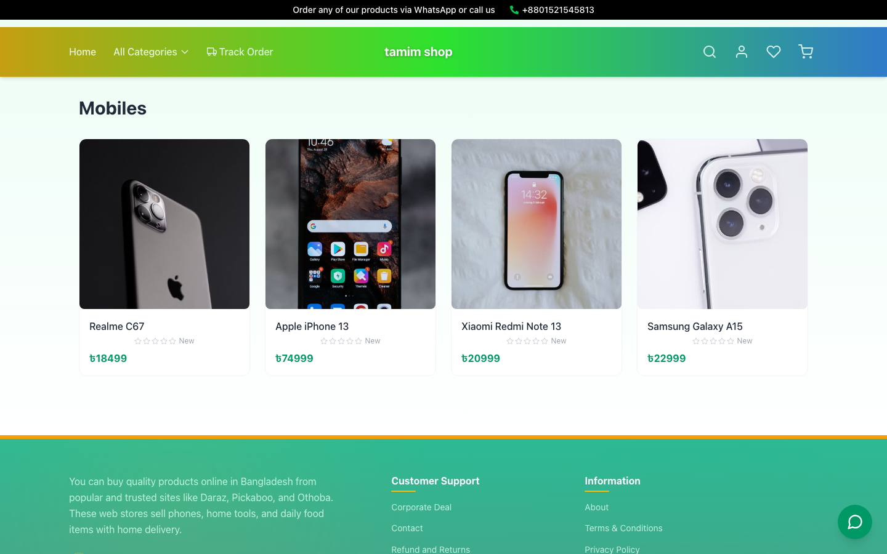
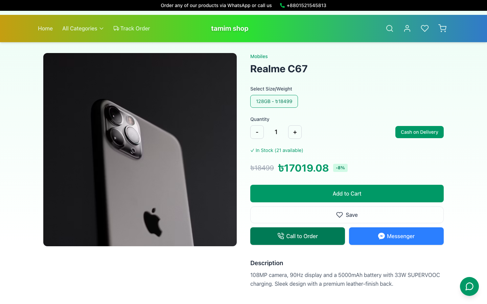
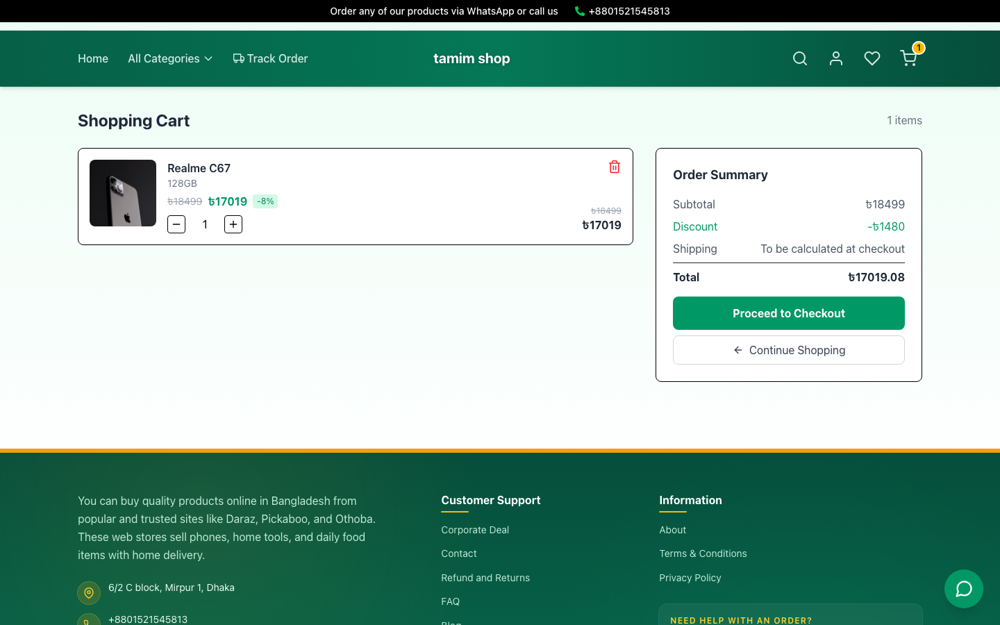
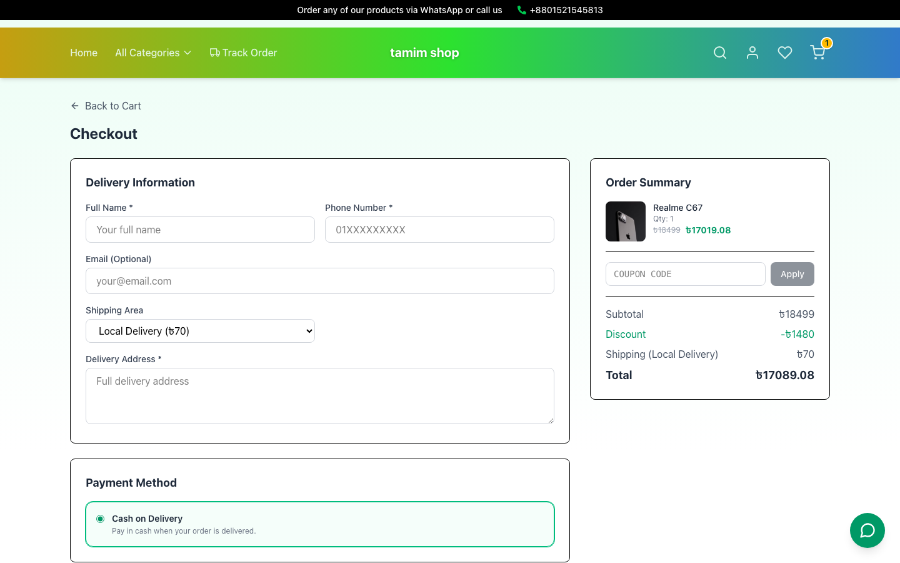
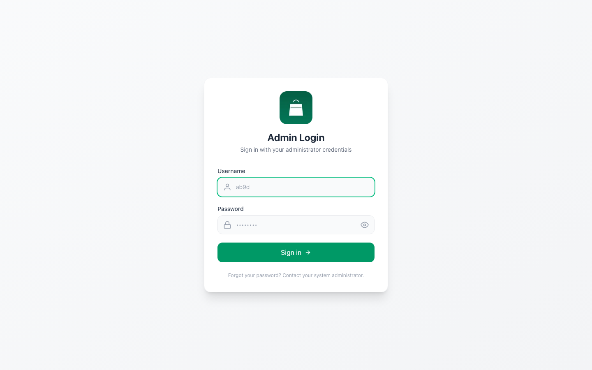

# Ab9dEcommerce

A full-stack, multi-tenant e-commerce platform — a Next.js storefront with cart/checkout/order-tracking for shoppers, paired with an Express + MongoDB API and a built-in Admin/POS panel for store owners to manage products, categories, and orders.

**Live demo:** [ecommerce-client-demo.vercel.app](https://ecommerce-client-demo.vercel.app)

## Screenshots

| Home | Category Listing |
|---|---|
|  |  |

| Product Detail | Cart |
|---|---|
|  |  |

| Checkout | Admin Login |
|---|---|
|  |  |

## Features

- Product catalog with categories, variants (size/weight), discounts, and stock tracking
- Cart, guest checkout, cash-on-delivery, and order tracking by phone/order ID
- Customer accounts: login/register, saved addresses, order history, wishlist
- Product reviews, related products, and site search
- Admin/POS dashboard: manage categories, upload/edit products, view and update orders
- Transactional email on order confirmation and status changes (shipped/delivered/etc.)
- SEO-friendly metadata, sitemap, and ISR cache invalidation on content changes

## Tech Stack

- **Frontend:** Next.js 16 (App Router), React 19, Tailwind CSS 4
- **Backend:** Node.js, Express, MongoDB/Mongoose
- **Other:** Cloudinary (media), JWT auth, Zod validation, Pino logging

## Structure

- [`frontend/`](frontend/) — Next.js storefront + admin/POS panel.
- [`backend/`](backend/) — Node.js / Express API server with MongoDB.

## Getting started

### Backend

```bash
cd backend
cp .env.example .env   # fill in real values
npm install
npm start
```

### Frontend

```bash
cd frontend
npm install
npm run dev
```

The frontend expects the backend URL via its own environment configuration. See each subdirectory for details.

## Notes

- `.env` files are git-ignored. Never commit secrets.
- `node_modules/`, `.next/`, `.vercel/`, and build artifacts are git-ignored.
